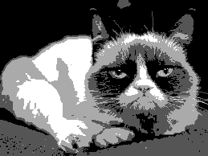
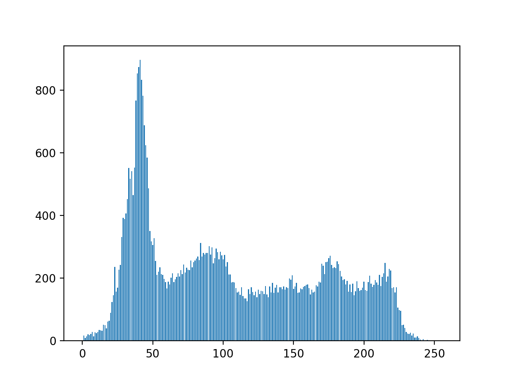

# X51 - Traitement d'images 

## Fichiers de base

Les fichiers de base de ces TP se trouvent dans le répertoire `/base`.
Le code fourni compile avec la commande `make`. 

Le programme obtenu n'est pas fonctionnel : certaines fonctions ne sont pas implémentées et retournent donc une valeur par défaut.
Vous pourrez implémenter les fonctions demandées directement dans ce répertoire.


## Outils

- Pour la visualisation des images et pour la lecture des images au format PGM et PPM vous pourrez installer le logiciel [ImageJ](https://imagej.nih.gov/ij/download.html). **Ce programme est installable localement, dans le répertoire de votre choix**
- La commande `convert` de ImageMagick (disponible sous Linux et Mac) permet de convertir tout type d'images au format PGM et PPM :

	```sh
	convert input.jpg input.pgm
	```


## TP1 : prise en main du code C++ et traitement des valeurs

### Structure de données : la classe Image
Dans ces TP nous manipulerons uniquement des images en 2 dimensions.
La taille d'une image sera donc définie par deux variables :

- `int dx` : la largeur de l'image (nombre de pixels contenus sur une ligne de l'image)
- `int dy` : la hauteur de l'image (nombre de pixels contenus sur une colonne de l'image)

Les pixels de l'image (en fait, la valeur de ces pixels) seront stockés dans un tableau unidimensionnel. En C++, la STL (Standard Template Library) fournit la classe générique `vector` permettant de manipuler une telle structure de manière efficace. Ainsi, les  pixels seront stockés dans la variable :

- `std::vector <T> pixels`

(nous verrons dans la suite ce que signifie `<T>`)

Les pixels sont stockés dans l'ordre de balayage de l'image : ligne par ligne, en commençant par le pixel en haut à gauche de l'image, qui a pour coordonnées $`(0,0)`$ (ordre *raster-scan*)

### Type d'une image

Une image possède un *type*, et il est très important de savoir exactement quel est le type des images qu'on manipule.
Par abus de langage, on définit le type d'une image par le type des valeurs de ses pixels.

Pour les images scalaires (c'est à dire à nuances de gris), on s'appuiera sur les types standards définis dans  le fichier `cstdint` :

- `uint8_t` : Images 8 bits à valeurs dans l'intervalle $`[0,255]`$
- `uint16_t` : Images 16 bits à valeurs dans l'intervalle $`[0,65535]`$
- ... 

ainsi que les types flottants `double` , `float`, etc.

Pour les images couleurs, on se limitera dans ce TP au type `RGB` défini dans `types.h``

```c++
struct RGB {
    uint8_t r;
    uint8_t g;
    uint8_t b;
};
```


### Classe générique

La classe `Image` est une classe générique, paramétrée par un type :

```c++
template <class T>
class Image
 {
	...

	std::vector<T> pixels;
	
	...
 }
```

Le type des pixels dépend donc du type avec lequel l'image a été instanciée : 

- si l'image a été instanciée avec le type `uint8_t`, le tableau `pixels` sera du type `vector <uint8_t> pixels` et pourra ainsi stocker des valeurs sur 8 bits
- si l'image a été instanciée avec le type `RGB`, le tableau `pixels` sera du type `vector <RGB> pixels` et pourra ainsi stocker des valeurs RGB

En C++, les classes génériques sont généralement séparées en deux fichiers : 
- un fichier `.h` qui contient leur déclaration
- un fichier `.hpp` (non standard : peut être également .cxx, .txx, etc.) qui contient leur définition

**En C++ les classes templates ne sont pas compilées**, elles sont uniquement définies dans des fichiers d'inclusion. Ces fichiers sont ensuite utilisés par les fichiers `.cpp` lors de l'instanciation des classes génériques.
- Exemple: 
	- la classe `Image` est paramétrée par un type, le type des valeurs de ses pixels
	- le fichier `main.cpp` inclut le fichier `image.h` 

### Déclaration d'une image

On utilisera la syntaxe suivante pour déclarer un objet de type `Image <T>` :

```c++
Image<uint8_t> image(10,5);  // image 8 bits de largeur 10 et de hauteur 5
Image<float> image(512,512); // image float de largeur 512 et de hauteur 512
```

Note : on évitera absolument l'utilisation de pointeurs. Dans le cadre de ces TP vous n'aurez donc jamais à utiliser de `new` ni de `delete`.

### Accès aux pixels 

Le C++ permet de surcharger l'opérateur « parenthèses »  `()`.
On utilisera cette fonctionnalité pour accéder aux pixels de l'image, ce qui permettra d'écrire des algorithmes plus lisibles en comparaison avec des accesseurs classiques :

```c++
v=image(3,6)  // au lieu de image.get_pixel(3,6)
image(3,6)=v; // au lieu de image.set_pixel(3,6,v) 
```


En outre, on souhaite pouvoir accéder à un pixel d'une image de deux manières :

- soit par l'intermédiaire de ses coordonnées $`(x,y)`$ 
	```c++
	for(int y=0; y < dy; y++) 
		for(int x=0; x < dx ; x++) 
			image(x,y)=v;
	```
- soit par l'intermédiaire de sa position (ou index, ou encore *offset*) dans le tableau `pixels`

	```c++
	for(int i=0; i < image.getSize() ; i++)
		image(i)=v;
	```

### Références

Le passage par référence est une fonctionnalité du C++ qui permet à une fonction de manipuler directement les données d'une variable, plutôt que de travailler avec une copie de la valeur. Cela offre plusieurs avantages, notamment une utilisation plus efficace de la mémoire et une modification directe des variables d'origine.

La syntaxe pour utiliser le passage par référence se fait en ajoutant le symbole `&`` après le type de données dans la déclaration des paramètres de la fonction. Par exemple :

```c++
void maFonction(Image <uint8_t> &image) {
	for(int i=0; i<image.getSize() ; i++)
    	image(i)=0;
}

...
Image <uint8_t> image(10,10);
maFonction(image);
// bouh mon image est devenue toute noire !

```

Lorsqu'une variable est passée en référence à une fonction, toute modification apportée à la variable à l'intérieur de la fonction est reflétée à l'extérieur de la fonction. 

Le passage par référence est souvent utilisé pour optimiser les performances d'un programme en évitant la copie inutile de grandes quantités de données : ceci est particulièrement utile dans le cadre du passage d'images en paramètres.

####  `const`

Si on veut éviter qu'une image passée en paramètres soit modifiée par erreur, mais qu'on souhaite toutefois la transmettre par référence (pour éviter la recopie) on utilise le mot-clé `const` :

```c++
// image est passée en "lecture seule"
void maFonction(const Image <uint8_t> &image) {
	for(int i=0; i<image.getSize() ; i++)
    	image(i)=0;
}

...
Image <uint8_t> image(10,10);
maFonction(image);
// monsieur ça compile pas !

```

### Travail à réaliser

La surcharge de l'opérateur `()` est implémentée dans les méthodes suivantes de la classe `Image` :

```c++
   
    // retourne une référence sur la valeur du pixel (x,y) de l'image
    T &operator()(const int &x, const int &y);

    // retourne la valeur du pixel (x,y) de l'image (version const : ne modifie pas l'image)
    T operator()(const int &x, const int &y) const;

    // retourne une référence sur la valeur du i-ème pixel de l'image
    T &operator()(const int &i);
    
    // retourne la valeur du i-ème pixel de l'image (version const : ne modifie pas l'image)
    T operator()(const int &i) const;
```

- les deux premières méthodes permettent d'accéder en lecture/écriture à un pixel de coordonnées (x,y) : implémenter ces fonctions qui retournent simplement la valeur du pixel (x,y) du tableau `pixels` 
- les deux méthodes suivantes permettent d'accéder en lecture/écriture à un pixel d'indice i : implémenter ces fonctions

Chaque version (coordonnées ou indice) a deux prototypes : 
- un prototype non-const qui renvoie une référence  : `T &operator() ` et permet donc de modifier la valeur du pixel
- un prototype const qui renvoie une copie de la valeur :  `T operator()` et permet de lire le pixel d'une image const (en *lecture seule* par abus de langage)


## Premières manipulations

### Attributs de Image

- Compiler et exécuter le programme `main.cpp`
- En vous appuyant sur les méthodes de la classe `Image` , écrire dans le `main` une fonction `print_info(const Image <uint8_t> &image)` qui affiche les informations suivantes pour une image 8 bits :
	- largeur et hauteur de l'image
	- nombre de pixels de l'image
	- valeur minimale et valeur maximale des pixels
	- somme des valeurs des pixels
	- niveau de gris moyen
- Tester la fonction sur une petite image synthétique.

### Entrées / sorties

Les fichiers `io.h` et `io.cpp` implémentent les fonctions :

```c++
Image<uint8_t> readPGM(const std::string &inputFile);
int writePGM(const Image<uint8_t> &image8b, const std::string &outputFile);

Image<RGB> readPPM(const std::string &inputFile);
int writePPM(const Image<RGB> &imageRGB, const std::string &outputFile);

```

permettant de lire et écrire sur le disque une image 8 bits ou RGB au format PGM / PPM binaire.

- Ecrire dans le `main` une fonction `test_lecture_ecriture` qui lit une image 8 bits au format PGM, et écrit une copie de l'image.
- Idem pour une image couleur au format PPM
- Tester la fonction.


## Transformations des valeurs 

Dans cette partie nous allons implémenter les fonctions du fichier `transformations_valeurs.cpp`. 
Nous travaillerons uniquement sur des images 8 bits.


### Seuillage 

Image originale |      Image seuillée (s_min=110, s_max=255)
:--------------:|:-----------------:
|


- Implémenter la fonction :

	```c++
	Image <uint8_t> seuillage(const Image <uint8_t> &image, uint8_t s_min, uint8_t s_max)
	```
	qui effectue un seuillage de l'image 8 bits `image` : les pixels ayant une valeur  comprise dans l'intervalle $`[s_{min},s_{max}]`$ prendront la valeur `255`, les autres la valeur `0`.
- Tester la fonction.


### Négatif

Image originale |      Négatif
:--------------:|:-----------------:
|


- Implémenter la fonction :
	```c++
	Image <uint8_t> negatif(const Image <uint8_t> &image);
	```
	qui calcule le négatif de l'image 8 bits passée en paramètre.
- Tester la fonction.

### Quantification des valeurs


Image originale |  Quantification sur 2 niveaux            |       Quantification sur 4 niveaux
:--------------:|:-----------------:|:-----------------:
| |  


- Implémenter la fonction :

	```c++
	Image <uint8_t> quantification(const Image <uint8_t> &image, int k);
	```
	qui effectue une quantification de l'image sur $`2^k`$ niveaux.
- On pourra procéder en deux étapes :
	- quantification des valeurs sur $`2^k`$ niveaux.
	- rééchelonnement des valeurs (ou étirement de contraste) sur l'intervalle $`[0,255]`$, de manière à ce que le niveau le plus élevé ait pour intensité `255`
- Tester la fonction

### Histogramme 

- Implémenter la fonction :

```c++
std::vector<int> histogramme(const Image <uint8_t> &image);
```

qui retourne sous forme d'un `vector<int>` l'histogramme de l'image passée en paramètre.

- Ecrire un programme `histogramme` qui prend en paramètre une image au format .pgm et affiche sur la sortie standard l'histogramme sous la forme :

```sh
histogramme input.pgm 
0 0
1 0
2 3
3 17
4 2
5 7
...
255 0
```

Vous pourrez ainsi utiliser le script python `plotHisto.py` pour obtenir une représentation graphique de l'histogramme :

```sh
histogramme input.pgm | ../plotHisto.py
```


Image  | 
:--------------:|:-----------------:
Histogramme |    


### Étirement de contraste

Image originale |      
:--------------:|:-----------------:
 Étirement de contraste (min=0, max=255) |

- Implémenter la fonction :

	```c++
	Image <uint8_t> etirement_contraste(const Image <uint8_t> &image, int new_min, int new_max);
	```
	qui effectue un étirement de contraste de l'image entre les valeurs `new_min` et `new_max`.

- Tester la fonction
- Afficher l'histogramme obtenu avant et après étirement de contraste.

### Égalisation d'histogramme

Image originale |   
:--------------:|:-----------------:
Égalisation d'histogramme | 

- Implémenter la fonction :

	```c++
	Image <uint8_t> egalisation(const Image <uint8_t> &image);
	```
	qui effectue une égalisation d'histogramme de l'image.

- Tester la fonction
- Afficher l'histogramme obtenu avant et après égalisation de l'histogramme.

## Images couleur

Dans le fichier `transformations_valeurs_rgb.cpp` on va implémenter des fonctions de transformation de valeurs dédiées aux images couleur RGB.

- Implémenter la fonction 
	```c++
	Image <RGB> egalisation_independante(const Image <RGB> &image);
	```
	qui calcule une égalisation d'histogramme sur une image `RGB` : l'égalisation sera faite indépendamment sur chaque bande de l'image. Que constatez-vous ?

- Pour pallier ce problème, une stratégie est de changer d'espace couleur. L'espace HSV (teinte, saturation, valeur) permet de décorréler la teinte de sa saturation et de sa valeur (ou intensité).

   1. Implémenter la fonction de conversion 
		```c++
		Image <HSV> convertir_RGB_HSV(const Image <RGB> &image);
		```
		qui convertit l'image dans l'espace HSV.
		
	2. Implémenter la fonction de conversion inverse 
		```c++
		Image <RGB> convertir_HSV_RGB(const Image <HSV> &image);
		```
	3. Implémenter la fonction :
		```c++
			Image <RGB> egalisation(const Image <RGB> &image);
		```
		qui égalise  l'image RGB de la manière suivante :
		- conversion de l'image RGB vers HSV
		- égalisation d'histogramme de la bande "V" (valeur)
		- conversion de l'image HSV résultante vers une image RGB

- Tester les deux fonctions et comparer les résultats avec et sans passage par l'espace HSV.


### Conversion RGB <-> HSV

Dans "types.h" on définit deux `struct` :

- `struct RGB { uint8_t r ; uint8_t g; uint8_t b;}`
- `struct HSV { double h; double s; double v; }`

On suppose que les valeurs RGB sont comprises dans l'intervalle $`[0,255]`$.
La valeur de la teinte (H : hue) représente un angle en degrés dans l'intervalle $`[0,360]`$. La saturation et la valeur (S et V) sont compris dans l'intervalle $`[0,1]`$.

- Conversion RGB vers HSV 
	1. Normalisation des valeurs RGB entre 0 et 1 :

		$`R'=\frac{R}{255} ; G'=\frac{G}{255}; B'=\frac{B}{255}`$

	2. $`V_{max} = \max(R',G',B')`$ 

		$`V_{min} = \min(R',G',B')`$ 

		$`V=V_{max}`$
		
		$`S=\begin{cases}
		0 \text{ si } V_{max}=0\\
		\frac{V_{max}-V_{min}}{V_{max}} \text{ sinon }
		\end{cases}
		`$

		$`H=60.\begin{cases}
				0 \text{ si }  V_{max}=V_{min}\\
				\frac{G'-B'}{V_{max}-V_{min}} \text{  si  } R'=V_{max}\\
				\frac{B'-R'}{V_{max}-V_{min}} +2 \text{  si  } G'=V_{max}\\
				\frac{R'-G'}{V_{max}-V_{min}} +4 \text{  si  } B'=V_{max}\\			\end{cases} \mod 360 `$

- Conversion HSV vers RGB

	

	$`(R',G',B')=\begin{cases}
	(V,V_3,V_1) \text{ si } \lfloor C \rfloor=0\\
	(V_2,V,V_1) \text{ si } \lfloor C \rfloor=1\\
	(V_1,V,V_3) \text{ si } \lfloor C \rfloor=2\\
	(V_1,V_2,V) \text{ si } \lfloor C \rfloor=3\\
	(V_3,V_1,V) \text{ si } \lfloor C \rfloor=4\\
	(V,V_1,V_2) \text{ si } \lfloor C \rfloor=5\\
	\end{cases}
	`$

	avec :

	$`C=H/60`$

	$`V_1=V(1-S)`$

	$`V_2=V(1-\alpha S)`$

	$`V_3=V(1-(1-\alpha) S)`$

	$`\alpha=C-\lfloor C \rfloor `$

## Annexe : notions de base en C++

### Structure d'un programme
- similaire au C : fichiers .h et .cpp
- les classes et fonctions définies dans un fichier foo.cpp sont déclarées dans un fichier foo.h (c'est une bonne pratique)

### Classes génériques (ou templates)
- elles sont paramétrées par un type
- elles sont séparées en général en deux fichiers : un fichier .h qui contient leur déclaration, et un fichier .hpp qui contient leur définition
- **les classes templates ne sont pas compilées**, elles sont uniquement incluses dans le fichier source .cpp qui les utilise.
- Exemple: 
	- la classe `Image` est paramétrée par un type, le type des valeurs de ses pixels
	- le fichier `main.cpp` inclut le fichier `image.h` 

### Compilation
- les fichiers .cpp sont compilés en fichiers objets .o
- les fichiers objets sont liés pour construire l'exécutable
- la compilation séparée (qui s'appuie généralement sur un Makefile) permet de recompiler uniquement les fichiers nécessaires
- le fichier `main.cpp` se compile de la manière suivante :

```sh
g++ main.cpp -o TP1
```
### Documentation
- http://www.cplusplus.com
- http://en.cppreference.com/w/

### Notions de base
#### Espaces de nom :
```cpp
namespace foo {
	class A {}
	...
}
```
Accès par :

```cpp
foo::A myClass;
``` 
ou

```cpp
using namespace foo; 
A myClass;
```

#### Librairie standard
Namespace `std`

Exemple, fonction d'affichage sur la sortie standard :

```cpp
std::cout << "Hello world !\n";
```


