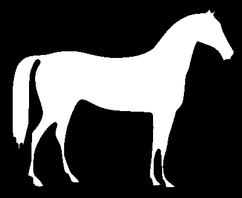

# X51 - Traitement d'images 

## TP5 : Filtres non-linéaires : morphologie mathématique

Dans ce TP vous utiliserez le langage Python ainsi que la bibliothèque `scikit-image`

## Morphologie mathématique

La morphologie mathématique est une discipline française qui a été développée par Georges Matheron et Jean Serra dans les années 1960. Elle s'appuie sur la théorie des ensembles et la topologie. Elle est utilisée pour l'analyse et le traitement d'images.
Elle peut-être considérée comme une boîte à outils pour le filtrage des images binaires ou en niveaux de gris.

La bibliothèque `scikit-image` propose des fonctions pour la morphologie mathématique. Vous pouvez consulter les liens suivants pour plus d'informations :

https://scikit-image.org/docs/stable/auto_examples/applications/plot_morphology.html

https://scikit-image.org/docs/stable/api/skimage.morphology.html


## Opérateurs de base 

Les définitions des opérateurs de base en morphologie mathématique sont rappelées ci-dessous.

L'*érosion* d'une image I par un élément structurant B est donnée au point $`(x,y)`$ par :
```math
\varepsilon_B(I)(x,y)=\min \{I(x+i,y+j) \mid (i,j) \in B\}
```

Autrement dit, la valeur du pixel  $`(x,y)`$ dans l'image érodée est le minimum des valeurs des pixels de l'image originale situés dans l'élément structurant B quand son centre est placé au point $`(x,y)`$.

La *dilatation* d'une image I par un élément structurant B est donnée au point $`(x,y)`$ par :

```math
\delta_B(I)(x,y)=\max \{I(x-i,y-j) \mid (i,j) \in B\}.
```

Autrement dit, la valeur du pixel  $`(x,y)`$ dans l'image dilatée est le maximum des valeurs des pixels de l'image originale situés dans le **symétrique** de l'élément structurant B  quand son centre est placé au point $`(x,y)`$.

**Remarques :** 

* Pourquoi le symétrique de B dans le cas de la dilatation ? Noter le signe `+` dans la définition de l'érosion qui est remplacé par le signe `-` dans la définition de la dilatation.
* Le symétrique de l'élément structurant B est défini par : $`B'=\{(i,j) \mid (-i,-j) \in B\}`$ (symétrie centrale de B).

On note $`\gamma_B`$ et $`\phi_B`$, respectivement, les opérateurs d'*ouverture* et de *fermeture* par l'élément structurant B :

L'ouverture d'une image par un élément structurant B est égale à l'érosion de l'image par B suivie de la dilatation de l'image érodée par B :

```math
\gamma_B(I)=\delta_B[\varepsilon_B(I)]
```

La fermeture d'une image par un élément structurant B est égale à la dilatation de l'image par B suivie de l'érosion de l'image dilatée par B :

```math
\phi_B(I)=\varepsilon_B[\delta_B(I)]
```


Le  *gradient morphologique* est défini au point $`(x,y)`$ par la différence arithmétique entre la dilatation et l'érosion de l'image par un élément structurant D :
```math
\rho(I)(x,y)=\delta_D(I)(x,y)-\varepsilon_D(I)(x,y),
``` 
où  D est le disque unité fermé défini par : $`D=\{(i,j) \mid i^2 + j^2 \leq 1\}`$


## Exemples

Considérons un élément structurant B carré de côté 3.

**Image binaire**

Ci-dessous, l'image originale, l'image érodée, l'image dilatée par B.





Ci-dessous, l'image originale, l'image ouverte, l'image fermée par B.


**Image en niveaux de gris**

Ci-dessous, l'image originale, l'image érodée, l'image dilatée par B.


Ci-dessous, l'image originale, l'image ouverte, l'image fermée par B.


## Exercice 1 : manipulation des opérateurs

En vous appuyant sur les fonctions de la bibliothèque `scikit-image`, écrire un programme Python qui prend en paramètre le nom d'une image en niveaux de gris valide et effectue les traitements suivants :

- calcul de l'érosion, de la dilatation, de l'ouverture et de la fermeture de l'image par un élément structurant carré de côté  3, puis affichage des différents résultats à l'écran sous forme de grille à l'aide des fonctions `subplot(...)` et `imshow(...)` de la bibliothèque `matplotlib.pyplot`.

- calcul de l'érosion, de la dilatation, de l'ouverture et de la fermeture de l'image par un élément structurant de type disque de rayon 7, puis affichage des différents résultats à l'écran sous forme de grille à l'aide des fonctions `subplot(...)` et `imshow(...)` de la bibliothèque `matplotlib.pyplot`.

- calcul du gradient morphologique, du gradient interne, du gradient externe  puis affichage des différents résultats à l'écran.

## Exercice 2 : filtrage morphologique

En utilisant une fermeture morphologique avec un élément structurant bien choisi, supprimer les lignes de l'image de gauche afin d'obtenir l'image de droite :

 
 


**Indications :**
* Pour charger l'image `lines.png`, vous pouvez utiliser la fonction `skimage.io.imread` de la bibliothèque `scikit-image`. Vous devrez utiliser le flag `as_gray=True` pour que l'image soit interprétée comme une image en niveaux de gris (et non pas en couleur).
* Vous pourrez vous appuyer sur la fonction `skimage.transform.rotate` pour générer l'élément structurant (bien lire la documentation de la fonction).


## Exercice 3 : rayures

A l'aide d'une fermeture  morphologique avec un élément structurant bien choisi, supprimer au mieux les rayures noires dans cette image :

 
 


 ## Exercice 4 : séparation disques / lignes

On souhaite séparer les pistes des pastilles du circuit électronique dans l'image `circuit.png`.

1. Seuiller pour extraire les pistes et les pastilles : chercher un seuil de manière empirique ou à partir de l'histogramme (voir la fonction `skimage.exposure.histogram`).
2. Utiliser un filtre morphologique pour éliminer les petites structures correspondant à du bruit
3. Appliquer un opérateur morphologique pour conserver uniquement les pastilles.
4. En déduire une opération pour conserver uniquement les pistes.

 
